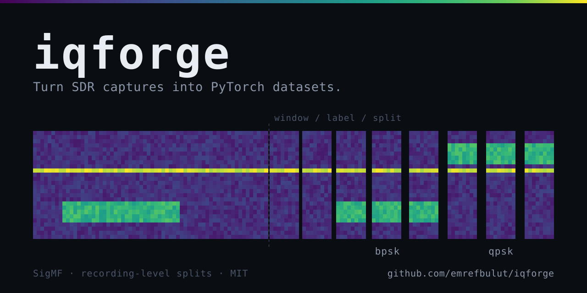

<p align="center">
  
</p>

<p align="center">
  <em>Turn SDR captures into PyTorch datasets — without silently corrupting them.</em>
</p>

---

> **Status: pre-release.** The capture → dataset pipeline works end to end and is
> covered by tests. Live SDR capture, baseline training, and PyPI packaging are not
> done yet. See [Roadmap](#roadmap). Interfaces may change before `0.1.0`.

## The problem

You have an SDR recording. You want to train a model on it.

Between those two sentences sit a dozen decisions that are easy to get wrong and
hard to notice: how to window the signal, where labels come from, how to normalize,
and — the one that quietly ruins results — how to split train from test.

Split your windows at random and neighbouring windows land in both train and test.
Your reported accuracy goes up. Your model gets worse. Nothing warns you.

`iqforge` makes those decisions explicit, gets the dangerous ones right by default,
and refuses to guess when it can't.

## Quickstart

```bash
pip install iqforge          # not published yet — see Roadmap
```

```bash
iqforge info    examples/bpsk_01.sigmf-meta   # what's in this recording?
iqforge inspect examples/bpsk_01.sigmf-meta   # look at it, in your terminal
iqforge build   examples/ -o dataset/         # cut, label, split, write
iqforge stats   dataset/                      # what did I just build?
```

```python
from iqforge import IQForgeDataset

train = IQForgeDataset("dataset/", split="train")
x, y = train[0]  # x: torch.Tensor (2, 1024) float32 — I and Q channels
train.label_map  # {"bpsk": 0, "qpsk": 1}
```

Sample recordings ship with the repo, so you can run all of the above without any
hardware.

## What it does

**Reads SigMF natively.** `.sigmf-meta` + `.sigmf-data`, via the reference
`sigmf` library. `cf32_le`, `ci16_le`, and `ci8` are supported; anything else is a
loud error rather than a silent guess. Large files are memory-mapped.

**Windows the signal.** Fixed length, configurable stride. Window count is exactly
`floor((N - window) / stride) + 1` — no padding, no partial windows.

**Labels from three sources.** SigMF annotations, directory names, or a CSV. Windows
that fall in more than one annotation are dropped and counted, never silently
assigned.

**Normalizes per window.** Unit power by default, so a model learns the signal rather
than the gain setting. Turn it off with `--no-normalize`.

**Exports three representations.** `iq2ch` (2×N real, the usual choice for PyTorch),
`complex`, or `magphase`.

**Writes a manifest.** Every dataset carries the config, the label map, the source
files, and which recording landed in which split. Same seed, same bytes.

## The split guarantee

This is the part that matters.

Windows from the same recording always land in the **same** split. Never train here
and test there. Splitting is stratified by class at the *recording* level, not the
window level.

When that isn't possible — one recording per class, or ratios that can't be
satisfied — `iqforge build` **stops with an error** and tells you your options. It
does not fall back to window-level splitting, because a tool that silently produces
an inflated accuracy number is worse than one that refuses to run.

```
Error: Cannot stratify by recording: class 'bpsk' has only 1 recording, but a
0.7/0.15/0.15 split needs at least 3 (train=0.7, val=0.15, test=0.15).

Windows from one recording must not appear in more than one split (SPEC §5.6);
falling back to window-level splitting inflates test accuracy.

Options:
  - provide more recordings per class (pass a directory)
  - reduce the split ratios, e.g. --split 0.5,0.25,0.25
  - build a training set only: --split 1.0,0,0
```

Balanced classes are not enough. A variable that carries no class information —
carrier frequency, receiver hardware, capture date — can still end up split along
with the data, so the model is evaluated on a condition it never trained on.
`--balance-by <sigmf-field>` spreads any SigMF field across the splits while
keeping the class stratification exact:

```bash
iqforge build examples/ -o dataset/ --balance-by core:freq_lower_edge
```

When that isn't structurally possible, you get a warning rather than an error —
the split is still valid, you just need to know what's left. `iqforge stats` prints
the carrier offset of every recording and a per-split summary, so the skew is
visible whether or not you asked for balancing.

## Roadmap

- [x] SigMF reading, metadata inspection
- [x] Terminal spectrogram
- [x] Windowing, labelling, recording-level splitting, sharded storage
- [x] `torch.utils.data.Dataset` + baseline classifier
- [x] Packaging (wheel + sdist), GitHub Actions CI
- [ ] PyPI release
- [ ] Live capture from RTL-SDR / HackRF / PlutoSDR
- [ ] Kitty and iTerm graphics protocols for the inspector

## How this relates to other tools

| | |
|---|---|
| [SigMF](https://github.com/sigmf/SigMF) | The recording format `iqforge` reads and writes. Not a competitor — the foundation. |
| [TorchSig](https://github.com/TorchDSP/torchsig) | Generates synthetic RF datasets and ships models. `iqforge` starts from *your* recording instead. Complementary. |
| [IQEngine](https://github.com/IQEngine/IQEngine) | Browser-based analysis and annotation of IQ recordings. `iqforge` is a CLI aimed at the training pipeline. |

The gap `iqforge` fills is the step between them: taking a real capture and turning
it into a dataset you can trust.

## Contributing

Issues and pull requests are welcome, especially from people who work with real RF
data. If `iqforge` misreads a recording from your hardware, that's the most useful
bug report you can file — please attach the `.sigmf-meta` if you can share it.

See [CONTRIBUTING.md](CONTRIBUTING.md) for setup, tests, and scope.

## Development

```bash
git clone https://github.com/emrefbulut/iqforge
cd iqforge
uv sync
uv run pytest
uv run ruff check
```

## AI usage disclosure

Substantial parts of this codebase were written with AI assistance
(Claude, Anthropic). Specification, methodology, review, and all design decisions
about signal handling — windowing, normalization, and the recording-level split
guarantee — were made and verified by the author. Correctness claims are backed by
the test suite, including mutation tests on the I/Q reading path.

## License

MIT. See [LICENSE](LICENSE).
