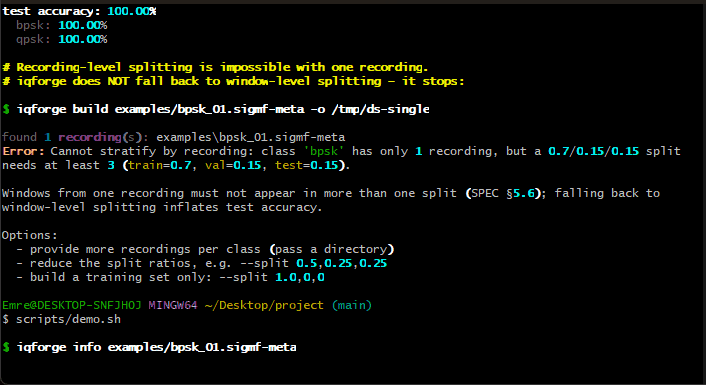
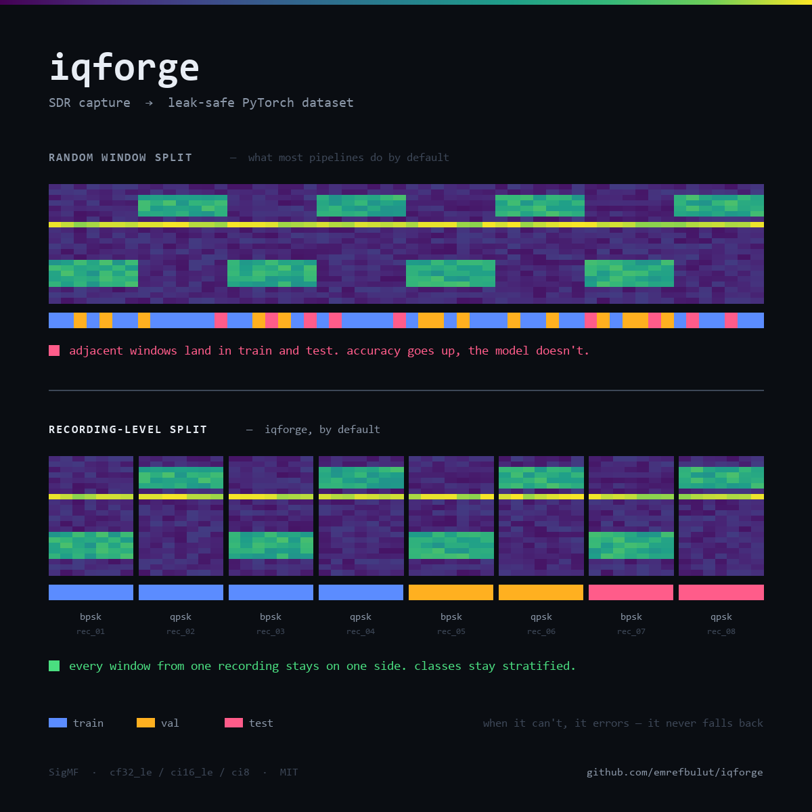

<p align="center">
  <em>Turn SDR captures into PyTorch datasets — without silently corrupting them.</em>
</p>

<p align="center">
  <a href="https://github.com/emrefbulut/iqforge/actions/workflows/ci.yml"></a>
  <a href="LICENSE"></a>
  
</p>

<p align="center">
  
</p>

---

> **Status: pre-release.** The capture → dataset pipeline works end to end and is
> covered by tests. `0.1.0` is not tagged or on PyPI yet — see
> [docs/publishing.md](docs/publishing.md) and the [Roadmap](#roadmap).
> Interfaces may change before `0.1.0`.

## The problem

You have an SDR recording. You want to train a model on it.

Between those two sentences sit a dozen decisions that are easy to get wrong and
hard to notice: how to window the signal, where labels come from, how to normalize,
and — the one that quietly ruins results — how to split train from test.

Split your windows at random and neighbouring windows land in both train and test.
Your reported accuracy goes up. Your model gets worse. Nothing warns you.

`iqforge` makes those decisions explicit, gets the dangerous ones right by default,
and refuses to guess when it can't.

## Quickstart

**From a clone** — works today, and brings the example recordings with it:

```bash
git clone https://github.com/emrefbulut/iqforge && cd iqforge
uv sync --extra torch            # pulls torch — expect a few minutes the first time
alias iqforge='uv run iqforge'   # so the commands below work as written
```

**From PyPI** — not published yet; see [docs/publishing.md](docs/publishing.md):

```bash
pip install 'iqforge[torch]'   # coming soon
```

Either way:

```bash
iqforge info    examples/bpsk_01.sigmf-meta   # what's in this recording?
iqforge inspect examples/bpsk_01.sigmf-meta   # look at it, in your terminal
iqforge build   examples/ -o dataset/ --balance-by core:freq_lower_edge
iqforge stats   dataset/                      # what did I just build?
```

```python
# from a clone, run this with: uv run python
from iqforge import IQForgeDataset

train = IQForgeDataset("dataset/", split="train")
x, y = train[0]  # x: torch.Tensor (2, 1024) float32 — I and Q channels
train.label_map  # {"bpsk": 0, "qpsk": 1}
```

Sample recordings ship with the repo, so you can run all of the above without any
hardware. `torch` is only needed for `IQForgeDataset` and `iqforge train`; drop
`--extra torch` (or install plain `iqforge`) if you only want to build datasets.

## What it does

**Reads SigMF natively.** `.sigmf-meta` + `.sigmf-data`, via the reference
`sigmf` library. `cf32_le`, `ci16_le`, and `ci8` are supported; anything else is a
loud error rather than a silent guess. Large files are memory-mapped.

**Windows the signal.** Fixed length, configurable stride. Window count is exactly
`floor((N - window) / stride) + 1` — no padding, no partial windows.

**Labels from three sources.** SigMF annotations, directory names, or a CSV. Windows
that fall in more than one annotation are dropped and counted, never silently
assigned.

**Normalizes per window.** Unit power by default, so a model learns the signal rather
than the gain setting. Turn it off with `--no-normalize`.

**Exports three representations.** `iq2ch` (2×N real, the usual choice for PyTorch),
`complex`, or `magphase`.

**Writes a manifest.** Every dataset carries the config, the label map, the source
files, and which recording landed in which split. Same seed, same bytes.

## The split guarantee

This is the part that matters.

<p align="center">
  
</p>

Windows from the same recording always land in the **same** split. Never train here
and test there. Splitting is stratified by class at the *recording* level, not the
window level.

When that isn't possible — one recording per class, or ratios that can't be
satisfied — `iqforge build` **stops with an error** and tells you your options. It
does not fall back to window-level splitting, because a tool that silently produces
an inflated accuracy number is worse than one that refuses to run.

```
Error: Cannot stratify by recording: class 'bpsk' has only 1 recording, but a
0.7/0.15/0.15 split needs at least 3 (train=0.7, val=0.15, test=0.15).

Windows from one recording must not appear in more than one split (SPEC §5.6);
falling back to window-level splitting inflates test accuracy.

Options:
  - provide more recordings per class (pass a directory)
  - reduce the split ratios, e.g. --split 0.5,0.25,0.25
  - build a training set only: --split 1.0,0,0
```

### How much does it actually inflate?

Measured, not asserted. The same windows, the same model, the same training-set
size — only the split assignment differs, over 15 seed pairs per point:

| burst SNR | recording-level | window-level | inflation |
|---|---|---|---|
| +5.8 dB | 98.4% | 98.9% | +0.5 pp ± 0.3 |
| +3.0 dB | 96.0% | 97.7% | +1.7 pp ± 1.1 |
| +0.9 dB | 88.5% | 95.7% | **+7.2 pp** ± 2.3 |
| −0.8 dB | 74.9% | 86.4% | **+11.5 pp** ± 4.0 |
| −2.2 dB | 59.0% | 72.5% | **+13.6 pp** ± 3.7 |
| −4.1 dB | 51.4% | 59.9% | **+8.5 pp** ± 2.2 |

Splitting at the window level buys you up to **13 points of accuracy that
isn't there**.

The curve is an inverted U, and both ends matter. Above +3 dB it flattens to
nothing: the honest split is already at the ceiling, so there is nothing left to
inflate. Below −2 dB it falls off again: the task is hard enough that even a
leaky test set cannot rescue the model. The damage peaks in between — where the
signal is marginal and a few points decide whether an approach looks viable,
which is exactly when you would be leaning on the number.

Read the shape, not the peak. Where your own data sits on this curve depends on
your SNR, your window length and your stride; what transfers is that the
inflation is largest precisely where the measurement matters most, and that
benchmarking a leaky split on easy data will tell you the problem does not
exist.

**Overlap is the mechanism.** Windows that overlap share samples, so a
window-level split puts pieces of the same signal on both sides. Holding the
window at 1024 and the SNR at −0.8 dB and varying only the stride:

| stride | overlap | recording-level | window-level | inflation |
|---|---|---|---|---|
| 1024 | 0% | 59.6% | 59.8% | +0.2 pp ± 2.7 |
| 768 | 25% | 71.8% | 72.3% | +0.5 pp ± 2.8 |
| 512 | 50% | 74.9% | 86.4% | **+11.5 pp** ± 4.0 |
| 256 | 75% | 71.3% | 94.1% | **+22.9 pp** ± 4.5 |
| 128 | 88% | 82.2% | 95.6% | **+13.4 pp** ± 3.1 |

At **zero overlap the inflation vanishes** — +0.2 pp, indistinguishable from
noise. That is the cleanest statement of the mechanism: without shared samples
there is nothing to leak, and window-level splitting is merely unwise rather
than wrong. Every stride below the window length leaks, and the default
`--stride 512` already sits in the range that costs you 11 points.

One caveat on reading down the column: changing the stride also changes how many
windows exist, so the last row's smaller gap is partly the honest baseline
improving on 8× more training data, not overlap mattering less. Within each row
the comparison is exact — same windows, same count, only the assignment differs.

Synthetic BPSK/QPSK, so read it as the shape of the problem rather than a
constant for your data. Reproduce with
[`scripts/leakage_experiment.py`](scripts/leakage_experiment.py); full runs in
[`artifacts/leakage_table.md`](artifacts/leakage_table.md).

[**docs/methodology.md**](docs/methodology.md) documents how both measurements
were designed, what was validated against real captures, the silent bugs found
along the way, and what the numbers do not cover.

### Balancing the nuisance variables

Balanced classes are not enough. A variable that carries no class information —
carrier frequency, receiver hardware, capture date — can still end up split along
with the data, so the model is evaluated on a condition it never trained on.
`--balance-by <sigmf-field>` spreads any SigMF field across the splits while
keeping the class stratification exact:

```bash
iqforge build examples/ -o dataset/ --balance-by core:freq_lower_edge
```

When that isn't structurally possible, you get a warning rather than an error —
the split is still valid, you just need to know what's left. `iqforge stats` prints
the carrier offset of every recording and a per-split summary, so the skew is
visible whether or not you asked for balancing.

## Known limitations

Both of these are measured, and both are consequences of decisions made on
purpose. They are here so you can tell before you start whether `iqforge` fits
your recording.

**Labelling is time-based, so busy recordings yield few windows.** A window is
labelled by the annotation whose sample range contains it. When several signals
are on air at once — separate in frequency, overlapping in time — every window
in that stretch falls inside more than one annotation, and those windows are
dropped and counted rather than assigned to whichever annotation happened to
come first.

On a real 40 MS/s capture of cellular downlink
(`cellular_downlink_880MHz` from the GNU Radio SigMF repository, 8 annotations),
that leaves **293 usable windows out of 39 061 — 0.75%**. The one annotation
that survived is the only one that does not share its time range with another.

The alternative would be to pick a winner by some heuristic — narrowest band,
strongest signal — which produces a full dataset of confidently wrong labels.
Dropping is recoverable; a silently mislabelled dataset is not. Frequency-aware
labelling is the real fix and is on the [roadmap](ROADMAP.md); until then, a
recording with one signal at a time works well and a dense spectrum does not.

**A datatype that lies cannot be caught.** `iqforge` derives the sample count
from the data file's size and the declared `core:datatype`, and checks that the
size divides evenly. That catches truncation. It cannot catch a file whose real
sample width differs from the declared one — 64-bit complex data labelled
`cf32_le`, for instance, reads as twice as many samples of garbage, and every
size check passes because the arithmetic is self-consistent.

This is not fixable from the metadata alone: SigMF has no independent sample-count
field to cross-check against. It is worth knowing about because the failure is
silent, and because at least one published dataset ships this way and documents
it only in prose on its download page. If a recording loads with a plausible
duration but the spectrogram is noise, suspect the datatype first.

## Roadmap

See [ROADMAP.md](ROADMAP.md) (Now / Next / Later). Short status:

- [x] SigMF reading, metadata inspection
- [x] Terminal spectrogram
- [x] Windowing, labelling, recording-level splitting, sharded storage
- [x] `torch.utils.data.Dataset` + baseline classifier
- [x] Packaging (wheel + sdist), GitHub Actions CI
- [ ] PyPI release (`0.1.0`)
- [x] Leakage measurement (recording-level vs window-level)
- [ ] Real SigMF verification (public files, then hardware)
- [ ] Live capture / richer inspector — later, see ROADMAP.md

## How this relates to other tools

| | |
|---|---|
| [SigMF](https://github.com/sigmf/SigMF) | The recording format `iqforge` reads and writes. Not a competitor — the foundation. |
| [TorchSig](https://github.com/TorchDSP/torchsig) | Generates synthetic RF datasets and ships models. `iqforge` starts from *your* recording instead. Complementary. |
| [IQEngine](https://github.com/IQEngine/IQEngine) | Browser-based analysis and annotation of IQ recordings. `iqforge` is a CLI aimed at the training pipeline. |

The gap `iqforge` fills is the step between them: taking a real capture and turning
it into a dataset you can trust.

## Contributing

Issues and pull requests are welcome, especially from people who work with real RF
data. If `iqforge` misreads a recording from your hardware, that's the most useful
bug report you can file — please attach the `.sigmf-meta` if you can share it.

See [CONTRIBUTING.md](CONTRIBUTING.md) for setup, tests, and scope.

## Development

```bash
git clone https://github.com/emrefbulut/iqforge
cd iqforge
uv sync --extra torch
uv run pytest
uv run ruff check
```

Plain `uv sync` also works, but it *removes* torch if you already installed it —
and the tests that need it then skip rather than fail, so it is easy to miss.

## License

MIT. See [LICENSE](LICENSE).
